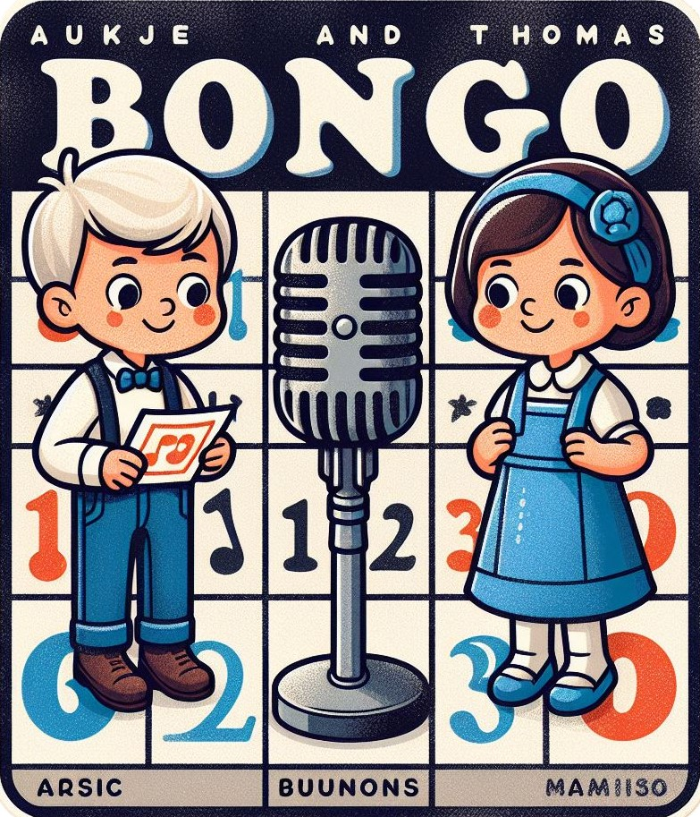

# Spotify Music Bingo

Spotify Music Bingo is a fun and interactive game that allows you to generate bingo cards from a Spotify playlist and play short clips of each song for a unique music bingo experience. Check out our [sample](sample-cards) Bingo cards for a sneak peek.

## Installation

We recommend using a [virtualenv](https://virtualenv.pypa.io/) for the installation process.

1. Clone this repository.
2. Set up a Python environment using Python 3.8.
3. Install the necessary dependencies using pip: `pip install -r requirements.txt`.

## Prerequisites

1. A Spotify Premium account is required.
2. Create a Spotify application [here](https://developer.spotify.com/dashboard/applications) and obtain its `Client ID` and `Client Secret`.
3. The environment variables `SPOTIPY_CLIENT_ID` and `SPOTIPY_CLIENT_SECRET` must be set for all the commands below. You can create a `localsecrets.py` file in the main directory for defining the envs..

## Usage

### Generate Bingo Cards

Use the following command to generate bingo cards:

`python -m musicbingo.runner generate-cards --playlist <playlist_url> --players <list_of_names, e.g. John,Paul,Ringo,George>`

The playlist URL should be in the format of a share link from Spotify.

### Start a New Game

Start a new game with the following command:

`python -m musicbingo.runner play-game --playlist <playlist_url> [--clip-duration <seconds>] [--duration-between-clips <seconds>] [--verbose]`

The `--clip-duration` option controls the length of the track clip played (default is 30 seconds). The `--duration-between-clips` option allows a silent gap to be played between each clip to better identify the start/end of a song (default is 2 seconds). The `--verbose` option will log each track after it has played.

### Resuming a Game

The order of the tracks played is randomized when a game is started. However, you can pass in a `game id` that is used to seed the randomization of the tracks. When a new game is started, the game id is displayed and can be passed back in with a starting track number to resume where you left off.

`python -m musicbingo.runner play-game --playlist <playlist_url> --game-id <game_id> --starting-track <track_number> [--clip-duration <seconds>] [--duration-between-clips <seconds>]`

When you exit a game, the `--game-id` and `--starting-track` will be output so you can resume later.

### Ending a Game

You can exit the game at any time with `ctrl+c` or wait until all the tracks have played and the game will stop itself.

## Notes

### Playlist URLs

Playlist URLs should be in the format of a share link from Spotify, like the following: `https://open.spotify.com/playlist/6zbtsC1O5v3xCIZQRPuDNl?si=ab86ea0724524246`. You can obtain these by clicking "Share" > "Copy Playlist Link" on a Spotify playlist.
